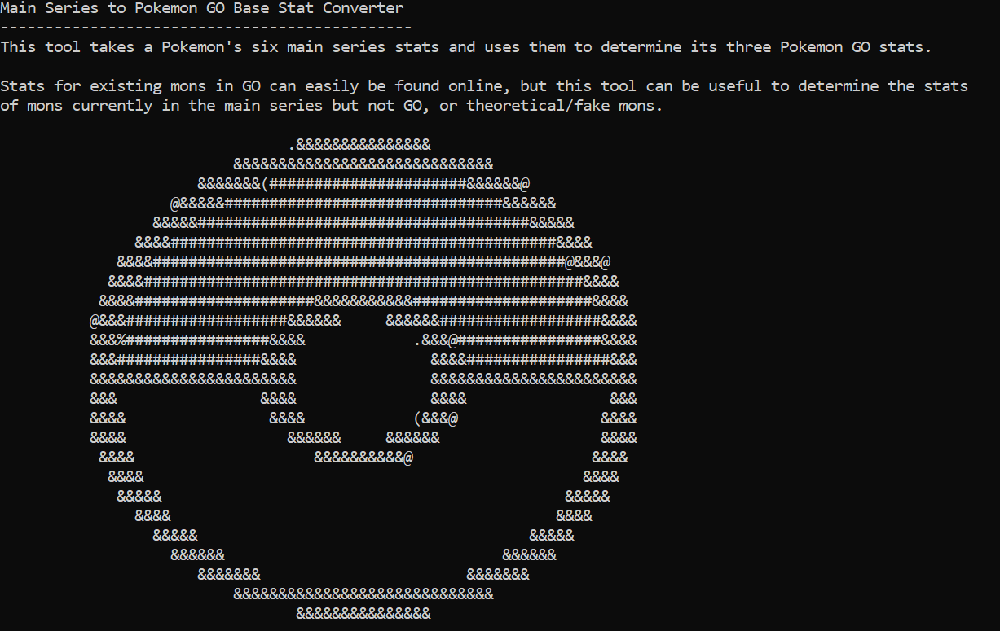
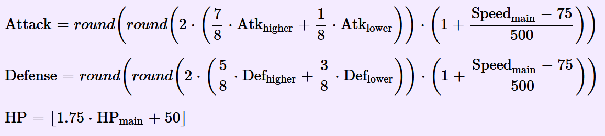
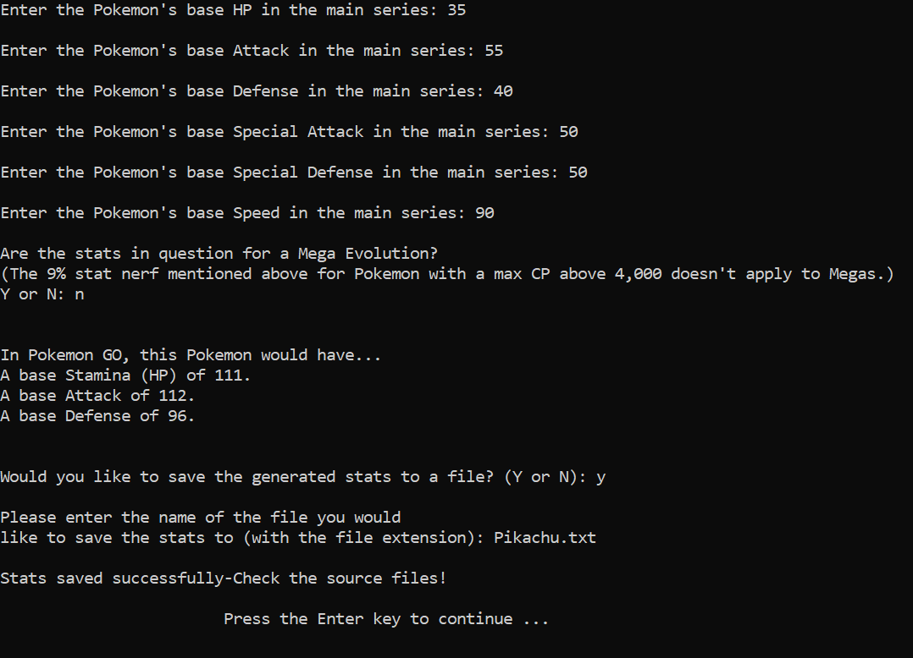
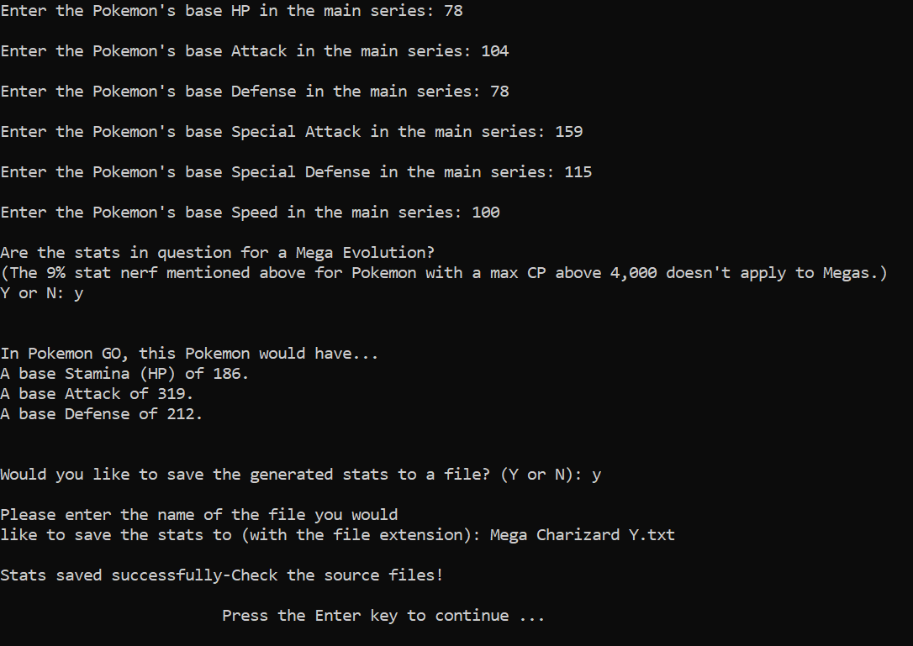
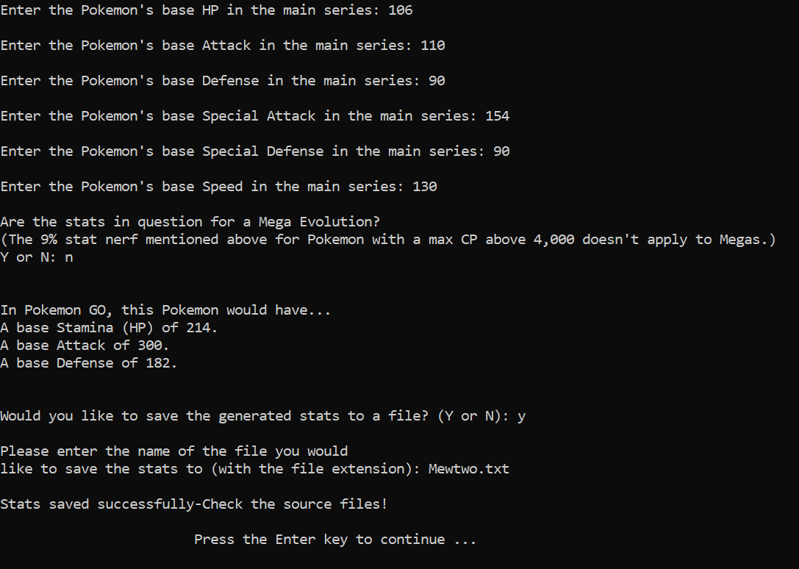

# Main Series to Pokemon GO Base Stat Converter



This is a tool to automatically calculate a Pokemon's base stats in Pokemon GO using its main series stats and the same formulas Niantic does to convert them. I couldn't find an existing tool to perform such calculations, so I made one myself both to satisfy that purpose and get some coding practice.

The user simply enters each of the Pokemon's six main series stats and whether or not the stats belong to a Mega Evolution (as it may produce incorrect results if Mega status isn't accounted for), and the calculator handles the rest. The entered and resulting stats can then be saved to an outfile afterwards. The formulas for each stat, along with my function applying them are as such:

## Formulas



## Calculation Function

```cpp
void convertStats(int mainSeriesHP, int mainSeriesAttack, int mainSeriesDefense, int mainSeriesSpecialAttack, int mainSeriesSpecialDefense, int mainSeriesSpeed, bool isMega, int& GOStamina, int& GOAttack, int& GODefense) { //Function to convert the read-in main series stats to GO stats
	double tempStamina = 1.75 * mainSeriesHP + 50.0; //Apply the formula to convert main series HP to GO Stamina (stores it in a double temporary value to avoid off-by-one errors when potentially applying the nerf)

	if (mainSeriesAttack >= mainSeriesSpecialAttack) { //If the mainSeriesAttack is higher (or both Attack stats are identical), it gets multiplied by .875
		GOAttack = static_cast<int>(round(round(2 * (.875 * mainSeriesAttack + .125 * mainSeriesSpecialAttack)) * (1 + (mainSeriesSpeed - 75) / 500.0))); //Apply the formula to convert main series stats to GO Attack
	}

	else { //If the mainSeriesSpecialAttack is higher, it gets multiplied by .875
		GOAttack = static_cast<int>(round(round(2 * (.875 * mainSeriesSpecialAttack + .125 * mainSeriesAttack)) * (1.0 + (mainSeriesSpeed - 75) / 500.0))); //Apply the formula to convert main series stats to GO Attack
	}

	if (mainSeriesDefense >= mainSeriesSpecialDefense) { //If the mainSeriesDefense is higher (or both Defense stats are identical), it gets multiplied by .625
		GODefense = static_cast<int>(round(round(2 * (.625 * mainSeriesDefense + .375 * mainSeriesSpecialDefense)) * (1.0 + (mainSeriesSpeed - 75) / 500.0))); //Apply the formula to convert main series stats to GO Defense
	}

	else { //If the mainSeriesSpecialDefense is higher, it gets multiplied by .625
		GODefense = static_cast<int>(round(round(2 * (.625 * mainSeriesSpecialDefense + .375 * mainSeriesDefense)) * (1.0 + (mainSeriesSpeed - 75) / 500.0))); //Apply the formula to convert main series stats to GO Defense
	}

	int CP = static_cast<int>(floor(max(10.0, (GOAttack * pow(GODefense, 0.5) * pow(tempStamina, 0.5) * pow(L50CPMultiplier, 2))/ 10))); //Calculate the Pokemon's CP at level 50 to determine whether or not to apply the 9% base stat nerf/tax if the resulting CP would be over 4,000

	if ((CP > 4000) && (isMega == false)) { //For Pokemon with over 4,000 max CP at level 50 (excluding Megas), stats are reduced by 9%
		tempStamina = tempStamina * 0.91f;
		GOAttack = static_cast<int>(round(GOAttack * 0.91));
		GODefense = static_cast<int>(round(GODefense * 0.91));
	}

	GOStamina = ((CP > 4000) && (isMega == false)) ? static_cast<int>(round(tempStamina)) : static_cast<int>(tempStamina); //Set the real GOStamina variable to the temporary value, rounding it if the nerf was applied and truncating it if not
}
```

## Disclaimers and Information About How the Process Works

(These are listed in the program as well.)

-A Pokemon's Stamina (HP) in GO is determined solely by its main series HP.

-A Pokemon's Attack stat in GO is determined mainly by the higher of its two main series Attack stats, and to a lesser extent by its lower Attack stat and Speed.

-A Pokemon's Defense stat in GO is determined using both its main series Defenses, with the higher one having a slightly greater impact. Speed also factors in a bit.

-If a Pokemon's max CP at level 50 WOULD be over 4,000 just going off the main series stats, then a 9% nerf is applied to each base stat. This does NOT apply to Mega Evolutions.

-This pre-nerf CP is NOT the same as the Pokemon's actual CP.

-There are a few exceptions where a Pokemon doesn't quite follow the regular base stat calculation rules, such as both Primals and Mega Rayquaza receiving a 3% nerf to each of their base stats. But under normal circumstances, these calculations are valid.

-The formulas for the conversions can be found at https://www.dragonflycave.com/pokemon-go/stats/, or in the screenshot in the source files.

-Additional details on GO stat calculation can be found at https://pokemongohub.net/post/wiki/pokemon-go-calculates-stats-max-cp/.

-A Pokemon's main series base stats can easily be found on sites like Bulbapedia or Serebii.

-A main series stat can range from 1 to 255.

-If a Pokemon received a stat BUFF in gens six or seven, such as Alakazam's Special Defense, then the POST-buff stats are used to determine the GO stats.

-If a Pokemon received a stat NERF in gens eight and beyond, such as Zacian's Attack, then the PRE-nerf stats are used to determine the GO stats.

## Examples

Pikachu (Regular Pokemon):


Mega Charizard Y (High CP Mega With NO Nerf Applied Due to it Being a Mega):


Mewtwo (Pokemon With Stat Nerf/Tax Applied):

